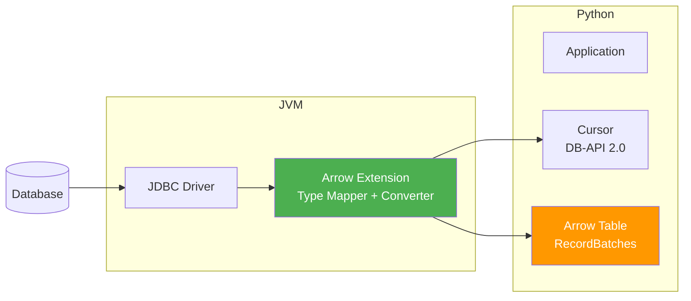
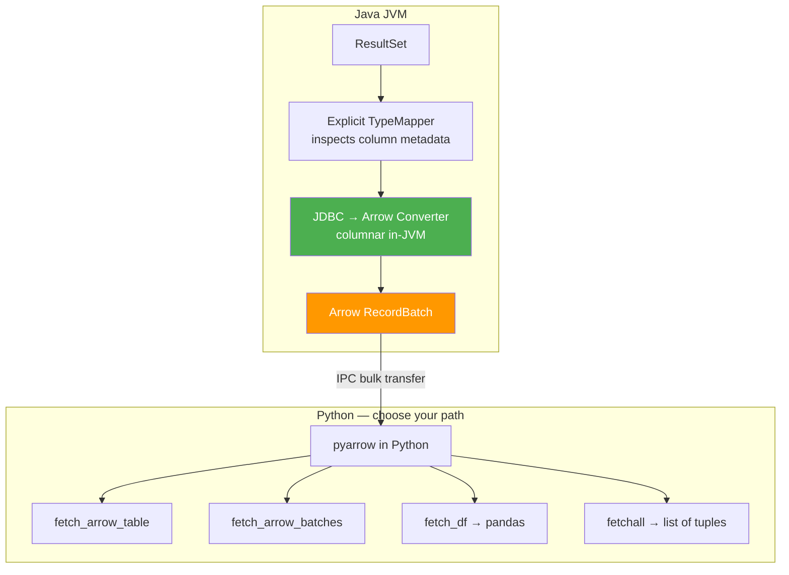
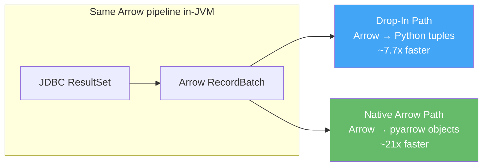
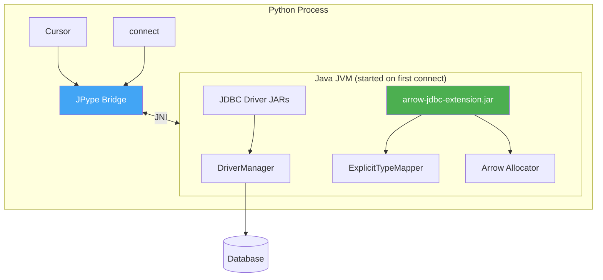

# Design

## Overview

JayDeBeApiArrow is a Python [DB-API 2.0](http://www.python.org/dev/peps/pep-0249/) driver that connects to any database with a JDBC driver. It's a fork of [jaydebeapi](https://github.com/baztian/jaydebeapi), redesigned around **Apache Arrow** for high-performance data transfer between the JVM and Python.

## The Performance Problem

The original jaydebeapi transfers data from Java to Python one cell at a time. Each value requires a JNI round-trip across the Java-Python boundary. For a table with *N* rows and *C* columns, this means roughly `3NC` JNI calls plus `2NC` Python object allocations.

Profiling shows that **~80% of execution time** is pure JNI overhead — 55% in Python object creation and 25% in the JPype bridge itself. This cost grows linearly with column count, making wide tables particularly expensive.

## Approach: Columnar Arrow Transfer

Instead of transferring data cell-by-cell, JayDeBeApiArrow converts the entire JDBC result set to Arrow record batches **inside the JVM**, then streams the batches to Python in bulk. The JNI boundary is crossed once per batch rather than once per cell.

## Two Data Paths

### Drop-In Path

Use `fetchall()`, `fetchone()`, `fetchmany()` — standard DB-API 2.0 methods that return Python tuples. Data still flows through the Arrow pipeline in-JVM (already much faster than the original), then gets converted to tuples for compatibility.

The tuple conversion requires one Python object allocation per cell — an irreducible CPython cost. This is the price of drop-in compatibility.

### Native Arrow Path

Use `fetch_arrow_table()`, `fetch_arrow_batches()`, `fetch_df()` — these return Arrow objects directly with no per-cell conversion. The performance gap over drop-in grows with column count, since Arrow transfer cost doesn't scale with cells but tuple conversion does.

See [Benchmarks](benchmarks.md) for detailed numbers.

## Architecture

### Python Layer

- **`connect()`** — entry point that starts the JVM (if needed), loads JDBC drivers, and returns a DB-API connection
- **`Connection`** — wraps a Java `Connection` with transaction management and context manager support
- **`Cursor`** — provides both standard DB-API fetch methods and Arrow-specific methods
- **JPype Bridge** — the JNI layer connecting Python to the JVM

### Java Layer

- **arrow-jdbc-extension.jar** — bundled with the Python package, handles all in-JVM data conversion
- **ExplicitTypeMapper** — inspects column metadata from each JDBC driver and builds a per-column type mapping, compensating for driver-specific quirks (see [Data Mapping](data-mapping.md))
- **Arrow Allocator** — shared memory pool for Arrow vectors

## JVM Lifecycle

The JVM starts on the first `connect()` call and persists for the lifetime of the Python process. JPype does **not** support `fork()` after JVM startup — see [Usage](usage.md#experimental-features) for workarounds.
